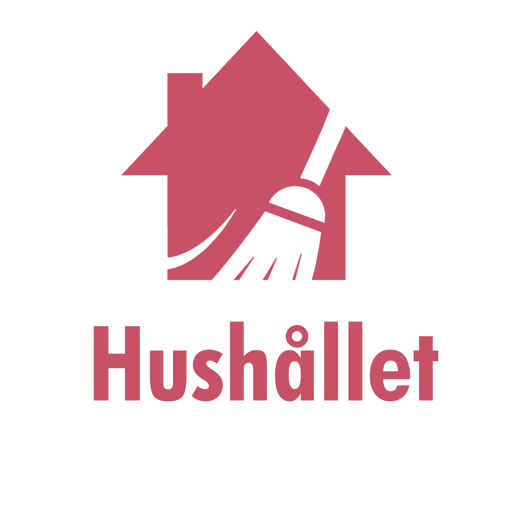

  

## Presented by team Skrik & Panik

Our team have made a mobile-application with the purpose to make it easier to get along and be reminded of various chores that needs to be taken care of in the household.   Our targeted audience is `families`, `partners` and/or `relatives`   The application is built with simplicity in mind so that everyone can quickly get a grasp and start completing chores, even _grand'ma_ !

### Installation

- Clone the project to to your computer from git using `git clone`
- Run `npm install` in the terminal to update with necessary dependencies
- Run `npm start` to startup the project
- Install `Expo Go` from your `App-store`
- Either scan the `QR-code` or start the project named `Hushållet`

### Usage

You can login with  email: Jonna@gmail.com   password: 123456   or create your own account

### ProductOwner

    
Click to see Details of Product Owner

    

  

---

### Requirements Specifications

Amount of requirements : **40.**  
**G**: 20 (50%).  
**VG**: 32 (80%). 

our total is _33_ requirements and 2 additionals that are up to productowner to decide on.

    
G requirements

    <b>Overall-krav</b>  
    1. &#9745; En logga, splashscreen och appikon ska designas och användas. *  
    2. &#9745; Applikationen ska byggas med RN, Expo & TS. *  
    3. &#9745; Designen av appen ska utgå ifrån befintliga skisser *  
    <b>Hushåll</b>  
    4. &#9745; Ett hushåll ska ha ett namn och en genererad (enkel) kod ,namnet ska gå att ändra. *  
    <b>Konto</b>  
    5. &#9745; En användare ska kunna logga in sig. *  
    6. &#9745; En användare ska kunna skapa ett nytt hushåll. *  
    7. &#9745; En användare ska kunna gå med i ett hushåll genom att ange hushållets kod. *  
    <b>Profil</b>  
    8. &#9745; En användare ska kunna ange sitt namn. *  
    9. &#9745; En användare ska kunna välja en avatar (emoji-djur + färg) från en fördefinierad lista. *  
    10. &#9745; Valda avatarer ska inte kunna väljas av andra användare i hushållet. *  
    11. &#9745; Avataren ska användas i appen för att visa vad användaren har gjort. *  
    <b>Sysslor</b>  
    12. &#9745; En ägare ska kunna lägga till sysslor att göra i hemmet. * 
    13. &#9745; En syssla ska ha ett namn, en beskrivning, hur ofta den görs (dagar), och en vikt* 
    14. &#9745; En ägare ska kunna redigera en syssla. * 
    15. &#9745; En ägare ska kunna ta bort en syssla. * 
    <b>Dagsvyn</b>  
    16. &#9745; Alla sysslor ska listas i en dagsvy och ge en översikt kring vad som behöver göras. *  
    17. &#9745; Vem/vilka som har gjort sysslan visas, hur många dagar sedan sysslan gjordes /försenad.* 
    18. &#9745; beskrivningen av sysslan visas och det ska även kunna markeras med ett tryck * 
    <b>Statistik</b>  
    19. &#9745; En användare ska kunna se fördelningen mellan användarna i sitt hushåll. * 
    20. &#9745; Varje statistikvy ska visa den totala fördelningen samt fördelning av varje enskild syssla* 
    21. &#9745; Det ska finnas en statistikvy över ”nuvarande vecka”. *  

    
VG requirements

    <b>Overall</b>  
    1. &#9745; All information ska kommuniceras till och från en server.  
    <b>Hushåll</b>  
    2. &#9745; Alla användare i ett hushåll ska kunna se vilka som tillhör ett hushåll 
    3. &#9745; En ägare av ett hushåll ska kunna se förfrågningar om att gå med i hushållet. 
    4. &#9745; En ägare ska kunna acceptera eller neka förfrågningar.  
    5. &#9745; En ägare ska kunna göra andra till ägare 
    6. &#9745; En ägare ska kunna pausa en användare och då tas det inte med i statistiken 
    <b>Profil</b>  
    7. &#9745; Om en användare tillhör två eller fler hushåll ska denne kunna välja att byta  
    <b>Sysslor</b>  
    8. &#9745; När en syssla tas bort ska användaren få en varning om att all statistik tas bort  
    <b>Konto</b>  
    9. &#9745; en ägare av hushållet först godkänna en ny användare.  
    10. &#9745; En användare ska kunna lämna ett hushåll 
    <b> Statestik </b>  
    11. &#9745; Det ska finnas en statistikvy över ”förra vecka”. 
    12. &#9745; Det ska finnas en statistikvy över ”förra månaden”.  

    
Extra features

    <b>Upp till produktägare att avgöra</b>  
    1. &#9745; Onboarding slide efter ny användare registreras 
    2. &#9745; Statistik vy för denna månaden 

Deviations

  <b>Only built for Android</b>

  

  

We dicided to move the edit button from the daily chore view to a modal instead. Shown in the pictures.  
 
 

  

  

Instead of having the images inside the piechart, we decided to relocate them below the main chart.

